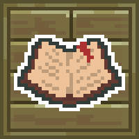

<h1 align="center">

 
<br />


<br />
**Amaruq Makpiraaqarvik**
</h1>

## Using
```groovy
repositories {
    // Other repositories... 
    maven {
        name "AmarokMaven"
        url "http://maven.snowlyicewolf.club/"
        allowInsecureProtocol = true
    }
}

dependencies {
    // Other dependencies... 
    
    implementation "club.someoneice.makpiraaqarvik:AmarokMakpiraaqarvik:1.20-${AmarokLibraryVersion}"
}
```

## License
[Pineapple License](LICENSE)