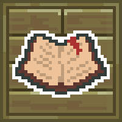

<h1 align="center">

  
**Amaruq Makpiraaqarvik**

</h1>

--- 

<h2 align="center">
A simple coding library for Minecraft NeoForge
</h2>

<div align="center">


</div>


## Using
```groovy
repositories {
    // Other repositories... 
    maven {
        name "AmarokMaven"
        url "http://maven.snowlyicewolf.club/"
        allowInsecureProtocol = true
    }
}

dependencies {
    // Other dependencies... 
    
    implementation "club.someoneice.makpiraaqarvik:AmarokMakpiraaqarvik:1.20-${AmarokLibraryVersion}"
}
```