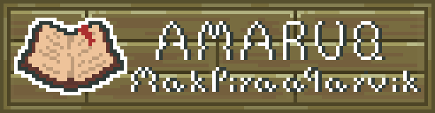

<div align="center">

  

Amaruq Makpiraaqarvik
---

**(Amarok Library)**

A simple coding library for Minecraft NeoForge


[](https://jitpack.io/#AmarokIce/AmarokMakpiraaqarvik)

</div>


## Using
```groovy
repositories {
    // Other repositories... 
    mavenCentral()
    maven { url 'https://jitpack.io' }
}

dependencies {
    // Other dependencies... 

    implementation 'com.github.AmarokIce:AmarokMakpiraaqarvik:1.21.1-1.0'
}
```